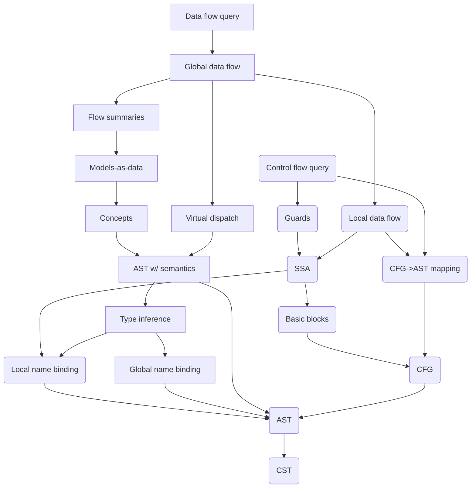
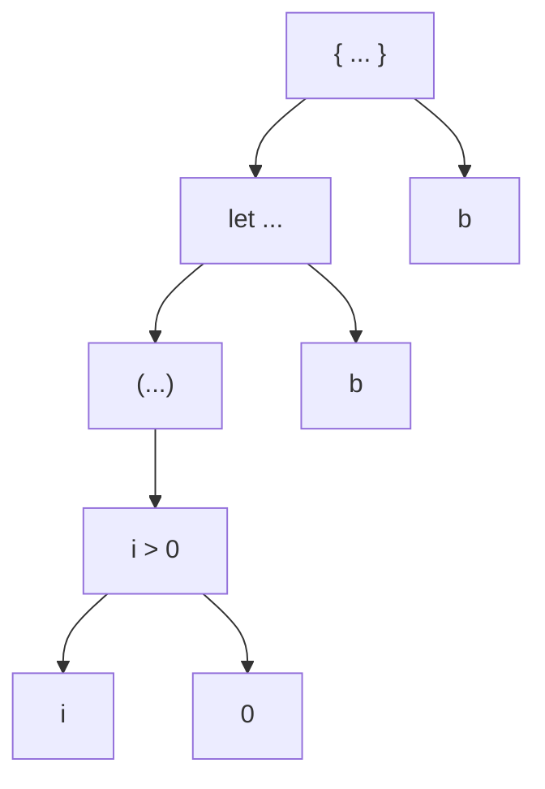
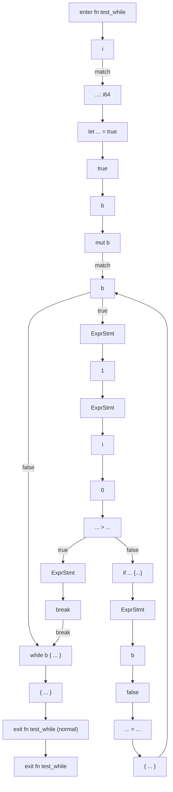

# QL building blocks

This document aims to describe the various QL building blocks that are typically used when building CodeQL support for a language, end-to-end.

Best practices:
- Use consistency checks from the beginning.
- Use DCA early on, including tracking of metrics for measuring progress, e.g. number of unresolved calls.
- Extract signatures/stubs of dependencies.

## Overview

The graph below gives an overview of the typical components. Components in rounded rectangles are ment to be amenable to incremental analysis, that is, to be intra-file analyses.



### Concrete syntax tree (CST)
Concrete syntax tree provided directly by the extractor.

```rust
fn foo(i: i64) -> bool {
    let b = (i > 0);
    b
}
```



### Abstract syntax tree (AST)
A `newtype` wrapper on top of the CST. Making it a `newtype` allows for nodes to be synthesized, e.g. via desugaring as done in Ruby [here](../ruby/ql/lib/codeql/ruby/ast/internal/Synthesis.qll)

For Rust and Swift, this layer is auto-generated, for Ruby it is maintained manually.

### Local name binding

Intra-function name binding (local variables and perhaps local declarations such as functions), should be amenable to incremental extraction.

Bind local variable accesses to their definitions, including parameters. This typically involves defining variable scopes and taking shadowing into account.

For Rust, the implementation is [here](../rust/ql/lib/codeql/rust/elements/internal/VariableImpl.qll).

### Global name binding

Inter-file name binding (modules, functions, types, etc.).

Involves import resolution.

```rust
mod foo; // imports `foo.rs`
use foo::bar; // makes `bar` available in the current scope

fn main() {
    bar();
}
```

For Rust, the implementation is [here](../rust/ql/lib/codeql/rust/internal/PathResolution.qll), and it is reffered to as _path resolution_.


### AST with Semantics
Abstract syntax tree layer, visible to query authors. Includes semantics information, for example exposes the local name binding analysis.

### Control flow graph (CFG)

Program evaluation order is represented via a control flow graph, where nodes represent entities in the AST, and edges represent evaluation successors.

There is a [shared library](../shared/controlflow/codeql/controlflow/Cfg.qll) for constructing CFGs in QL, and an example of how Rust uses it can be seen [here](../rust/ql/lib/codeql/rust/controlflow/internal/ControlFlowGraphImpl.qll).

Tips:
- Include as much as possible in the CFG, even if it represents entities that are not actually evaluated, such as assignment left-hand-sides and parameters.
- Enable consistency checks, especially the dead-end consistency check is extremely useful for surfacing bugs.

Shared CFG library: ~1.7 KLoC

Rust-specific: ~1.2 KLoC

#### Example

```rust
fn test_while(i: i64) {
    let mut b = true;
    while b {
        1;
        if (i > 0) {
            break;
        }
        b = false;
    }
}
```



### Basic blocks

There is a [shared library](../shared/controlflow/codeql/controlflow/BasicBlock.qll) for constructing basic blocks in QL, and the [shared library for constructing CFGs](../shared/controlflow/codeql/controlflow/Cfg.qll) exposes a default basic block implementation as well.

Shared basic blocks library: ~370 LoC

Rust-specific: ~20 LoC

### Static single-assignment (SSA) form

Static single-assignment (SSA) is used for:
- Def-use style flow
- Use-use flow
- Guards

```csharp
if (b)
    x = 1;
else
    x = 2;
// phi
y = x + 1;
if (b2)
    y = x;
else
    y = x + 1;
// phi read
z = x + 1;
```

There is a [shared library](../shared/ssa/codeql/ssa/Ssa.qll) for SSA construction in QL, and an example of how Rust uses it can be seen [here](../rust/ql/lib/codeql/rust/dataflow/internal/SsaImpl.qll).

The shared SSA library is heavily optimized, and avoids quadratic pitfalls in def/use-use relations by embedding phi (read) nodes in the data flow graph.

Shared SSA library: ~2.3 KLoC

Rust-specific: ~700 LoC

### Guards

The shared SSA library gives _barrier guards_ for free, other languages like Java and C# have more sophisticated guards analysis, e.g.
```csharp
var b = x != null;
if (b) {
    x.Foo(); // x is not null here
}
```

`@aschackmull` is currently working on a shared guards library.


### Concepts

Defines common concepts such as database access and remote sources. Models-as-data definitions typically contribute to concepts.

### Type inference

Type inference is about assigning types to expressions, and resolving member accesses such as method calls and field accesses.

We assume that the program is well-typed, so we do not actually check this, but instead optimistically derives as much type information as possible.

```rust
let x = foo(); // name binding needed to know the return type of `foo`
let y = x.bar(); // type needed to know the type of `x` to resolve `bar`
```

Challenge: Generics. Solution: Type-path-indexed relations, provided in the shared library.

Shared type inference library: ~800 LoC

Rust-specific: ~1 KLoC

### Virtual dispatch

Name resolution and type inference resolve the _static_ targets of calls. Virtual
dispatch is about resolving all the the possible _dynamic_ targets, i.e. which functions may actually be called at runtime (method overriding in OOP, trait implementations in Rust).

### Local data flow

SSA steps, but also steps such as from `x` to `y = x;`.

### Global data flow

Shared data flow library: ~6 KLoC

Rust-specific: ~1.8 KLoC

### Canonical names


### Models as Data (MaD)

Includes computing canonical/fully qualified names.

### Flow Summaries

Shared library: ~2.4 KLoC

Rust-specific: ~300 LoC

### CFG->AST mapping
